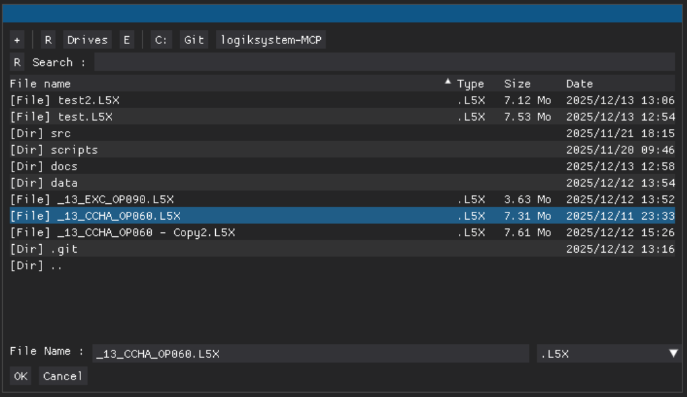
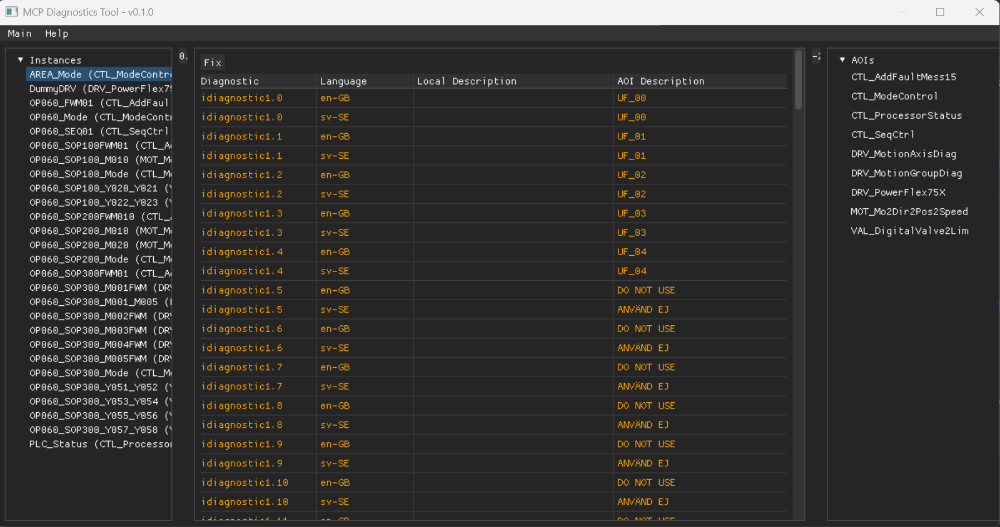
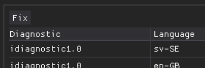
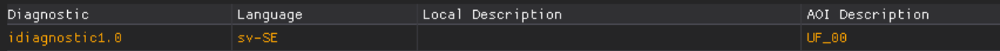
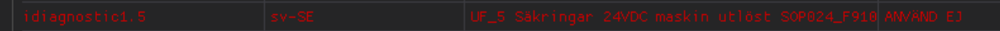
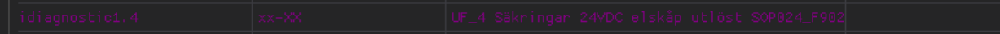
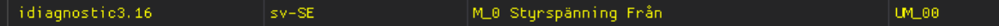

# MCP Diagnostics Tool

## 1. Excution

Make sure you have Python installed. Install requirements by typing:

```python
pip install --upgrade -r requirements
```

Run the main.py script to start the tool:
```python
python main.py
```

## 2. Load a file

To load a file, select File->Load in the main menu. The tool supports L5X files from Studio5000.

The file explorer will open and you can select a compatible file. Then click on OK.



## 3. Layout

The tool is separated in 3 panels.
- Left panel: Shows all MCP AOI instances found in the project.
- Central panel: Displays all diagnostic texts of the selected AOI instance.
- Right panel: Shows all found MCP AOI instructions.



## 4. Diagnostics table: Checking AOI Instance

The table will show a line for each disgnostic bit and language.
Each MCP AOI allows using only specific bits for instance specific diagnostics, called "user defined" (UF, UW or UM).

The rest of diagnostics should exactly the same text for the instance as the AOI, or include a correct text. Valid diagnostics will be marked with white color.



If you click on the Fix button on the top, the texts will be fixed following the next rules:

### 4.1. Empty instance description

When the instance description is missing it will be marked with orange color.



These diagnostics will be overwritten with the AOI text.

### 4.2. Not allowed instance description

If the AOI description is "DO NOT USE" or "ANVÄND EJ", it will be marked with red color.



These diagnostics will be overwritten with the AOI description.

### 4.3. Not allowed language

If the instance includes a not allowed language, they will be displayed with purple color.



These diagnostics will be removed when the instance is fixes.

### 4.4. Wrong prefix in instance texts

Instance specific description should start wuth "UF", "UW" or "UM". If that is not the case, they will be marked with yellow color.



These diagnostics will not be fixed.

## 5. Save a file

To save the fixed project, select File->Save in the main menu.

The file explorer will open and you can select a compatible file or type a new name to create a new file. Then click on OK.
